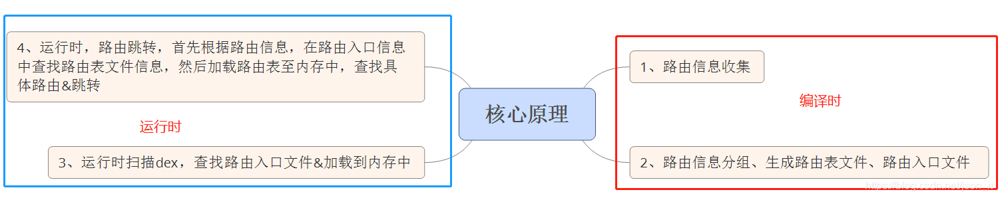

服务调用Iproider，SPI，全称Service Provider Interfaces，服务提供接口。是Java提供的一套供第三方实现或扩展使用的技术体系。解耦了服务提供与服务使用。
Arouter整体代码设计都是一句这个思想
#### [Arouter](https://github.com/alibaba/ARouter)

* 路由生成：编译时
    收集路由信息  ->  对路由信息分组 
    每个路由分组生成一个路由表文件
    生成路由入口文件；

* 路由跳转：运行时
    [依据分组名]查找路由入口：在路由入口文件查找对应的路由表文件是哪个；
    加载路由表文件；
    根据路由path信息，在路由表文件中查找具体的路由信息；
    拿到足够的信息，进行路由跳转。  

#### Warehouse
包含了所有的路由信息（路由跳转，服务类，拦截器）。可以通过Warehouse拿到不同类型的路由信息。

		class Warehouse {
		    // Cache route and metas
		    static Map<String, Class<? extends IRouteGroup>> groupsIndex = new HashMap<>();
		    static Map<String, RouteMeta> routes = new HashMap<>();
		
		    // Cache provider
		    static Map<Class, IProvider> providers = new HashMap<>();
		    static Map<String, RouteMeta> providersIndex = new HashMap<>();
		
		    // Cache interceptor
		    static Map<Integer, Class<? extends IInterceptor>> interceptorsIndex = new UniqueKeyTreeMap<>("More than one interceptors use same priority [%s]");
		    static List<IInterceptor> interceptors = new ArrayList<>();
		
		    static void clear() {
		        routes.clear();
		        groupsIndex.clear();
		        providers.clear();
		        providersIndex.clear();
		        interceptors.clear();
		        interceptorsIndex.clear();
		    }
		}

* 路由原理，生成路由表Group表。反射构造实例。获取里面的路由添加到warehouse的map,ARouter$$Root$$(moduleName),ARouter$$Group$$(path)

		

		public class ARouter$$Root$$app implements IRouteRoot {
		  @Override
		  public void loadInto(Map<String, Class<? extends IRouteGroup>> routes) {
		    routes.put("test", ARouter$$Group$$test.class);
		    routes.put("yourservicegroupname", ARouter$$Group$$yourservicegroupname.class);
		  }
		}

		public class ARouter$$Group$$test implements IRouteGroup {
		  @Override
		  public void loadInto(Map<String, RouteMeta> atlas) {
		    atlas.put("/test/activity1", RouteMeta.build(RouteType.ACTIVITY, Test1Activity.class, "/test/activity1", "test", new java.util.HashMap<String, Integer>(){{put("ser", 9); put("ch", 5); put("fl", 6); put("dou", 7); put("boy", 0); put("url", 8); put("pac", 10); put("obj", 11); put("name", 8); put("objList", 11); put("map", 11); put("age", 3); put("height", 3); }}, -1, -2147483648));
		    atlas.put("/test/activity2", RouteMeta.build(RouteType.ACTIVITY, Test2Activity.class, "/test/activity2", "test", new java.util.HashMap<String, Integer>(){{put("key1", 8); }}, -1, -2147483648));
		    atlas.put("/test/activity3", RouteMeta.build(RouteType.ACTIVITY, Test3Activity.class, "/test/activity3", "test", new java.util.HashMap<String, Integer>(){{put("name", 8); put("boy", 0); put("age", 3); }}, -1, -2147483648));
		    atlas.put("/test/activity4", RouteMeta.build(RouteType.ACTIVITY, Test4Activity.class, "/test/activity4", "test", null, -1, -2147483648));
		    atlas.put("/test/fragment", RouteMeta.build(RouteType.FRAGMENT, BlankFragment.class, "/test/fragment", "test", null, -1, -2147483648));
		    atlas.put("/test/webview", RouteMeta.build(RouteType.ACTIVITY, TestWebview.class, "/test/webview", "test", null, -1, -2147483648));
		  }
		}

#### SPI

全称Service Provider Interfaces，服务提供接口。是Java提供的一套供第三方实现或扩展使用的技术体系。主要通过解耦服务具体实现以及服务使用，使得程序的可扩展性大大增强，甚至可插拔。在ARouter中Iprovider是个简单的接口，只有init（），但是配合路由就可以查找到扩展接口的实现类，解耦了服务的提供和使用

Provider，默认实现一些依赖注入的服务，也是通过路由找到类，反射构造实例

		switch (routeMeta.getType()) {
			case PROVIDER:  // if the route is provider, should find its instance
			// Its provider, so it must implement IProvider
				Class<? extends IProvider> providerMeta = (Class<? extends IProvider>) routeMeta.getDestination();
				IProvider instance = Warehouse.providers.get(providerMeta);
				if (null == instance) {
					// There's no instance of this provider
					IProvider provider;
					try {
						provider = providerMeta.getConstructor().newInstance();
						provider.init(mContext);
						Warehouse.providers.put(providerMeta, provider);
						instance = provider;
					}
					catch (Exception e) {
						throw new HandlerException("Init provider failed! " + e.getMessage());
					}
				}
				postcard.setProvider(instance);
				postcard.greenChannel();
				// Provider should skip all of interceptors
				break;
			case FRAGMENT:
				postcard.greenChannel();
			// Fragment needn't interceptors
			default:
				break;
		}

		public class ARouter$$Providers$$module1 implements IProviderGroup {
		  @Override
		  public void loadInto(Map<String, RouteMeta> providers) {
		    providers.put("com.example.module1.IUserService", RouteMeta.build(RouteType.PROVIDER, UserServiceImpl1.class, "/u/1", "u", null, -1, -2147483648));
		    providers.put("com.example.module1.IUserService", RouteMeta.build(RouteType.PROVIDER, UserServiceImpl2.class, "/u/2", "u", null, -1, -2147483648));
		  }
		}

#### 拦截

也是继承Iproider。一次性全部加载，每次调用navigation其实都会调用拦截器，看是否调用拦截

InterceptorServiceImpl是ARouter中管理拦截器的服务类。说明一下所有的自定义拦截器都需要继承自IInterceptor，而IInterceptor的父类就是IProvider。可见拦截器不过是一种特殊的服务类而已。
在_ARouter.navigation()中被调用。可见每次路由操作都会走到拦截器逻辑中（除了设置了走绿色通道的操作）。

* 跟服务和路由不同，拦截器类是一次性加载完的，不会按需加载。
* 由于可能涉及到很多拦截器的加载，所以拦截器的初始化实在线程池中完成的。
* 首先迭代Warehouse.interceptorsIndex集合。
* 初始化完成的拦截器都添加到Warehouse.interceptors集合中
* 拦截器逻辑在LogisticsCenter.executor中执行。所以拦截器逻辑是在异步线程中执行的。
* 通过CancelableCountDownLatch interceptorCounter = new CancelableCountDownLatch(Warehouse.interceptors.size());方法，增加了对拦截器操作的超时处理。
* 通过调用await来设置等待超时时间。当超过postcard中设置的超时时间之后会主动唤起阻塞的线程，执行接下来的逻辑。

	
		public class ARouter$$Interceptors$$app implements IInterceptorGroup {
		  @Override
		  public void loadInto(Map<Integer, Class<? extends IInterceptor>> interceptors) {
		    interceptors.put(7, Test1Interceptor.class);
		    interceptors.put(8, Test1Interceptor2.class);
		  }
		}

#### 缺点

运行时查找dex,扫描后会存储在SharedPreferences中，所以初始化慢

		public synchronized static void init(Context context, ThreadPoolExecutor tpe) throws HandlerException {
		    //load by plugin first
		    loadRouterMap();
		    if (registerByPlugin) {
		        logger.info(TAG, "Load router map by arouter-auto-register plugin.");
		    } else {
		        Set<String> routerMap;
		
		        // It will rebuild router map every times when debuggable.
		        if (ARouter.debuggable() || PackageUtils.isNewVersion(context)) {
		            logger.info(TAG, "Run with debug mode or new install, rebuild router map.");
		            // These class was generated by arouter-compiler.
		            //反射扫描对应包
		            routerMap = ClassUtils.getFileNameByPackageName(mContext, ROUTE_ROOT_PAKCAGE);
		            if (!routerMap.isEmpty()) {
		            	//
		                context.getSharedPreferences(AROUTER_SP_CACHE_KEY, Context.MODE_PRIVATE).edit().putStringSet(AROUTER_SP_KEY_MAP, routerMap).apply();
		            }
		
		            PackageUtils.updateVersion(context);    // Save new version name when router map update finishes.
		        } else {
		            logger.info(TAG, "Load router map from cache.");
		            routerMap = new HashSet<>(context.getSharedPreferences(AROUTER_SP_CACHE_KEY, Context.MODE_PRIVATE).getStringSet(AROUTER_SP_KEY_MAP, new HashSet<String>()));
		        }
		        ....
		    }
		}

#### 优化改进
编译期在loadRouterMap中插入了register代码，通过这种方式即可避免在运行时通过反射扫描className,优化了启动速度
	

	//源码代码，插桩前
	private static void loadRouterMap() {
		//registerByPlugin一直被置为false
	    registerByPlugin = false;
	}
	//插桩后反编译代码
	private static void loadRouterMap() {
	    registerByPlugin = false;
	    register("com.alibaba.android.arouter.routes.ARouter$$Root$$modulejava");
	    register("com.alibaba.android.arouter.routes.ARouter$$Root$$modulekotlin");
	    register("com.alibaba.android.arouter.routes.ARouter$$Root$$arouterapi");
	    register("com.alibaba.android.arouter.routes.ARouter$$Interceptors$$modulejava");
	    register("com.alibaba.android.arouter.routes.ARouter$$Providers$$modulejava");
	    register("com.alibaba.android.arouter.routes.ARouter$$Providers$$modulekotlin");
	    register("com.alibaba.android.arouter.routes.ARouter$$Providers$$arouterapi");
	}
